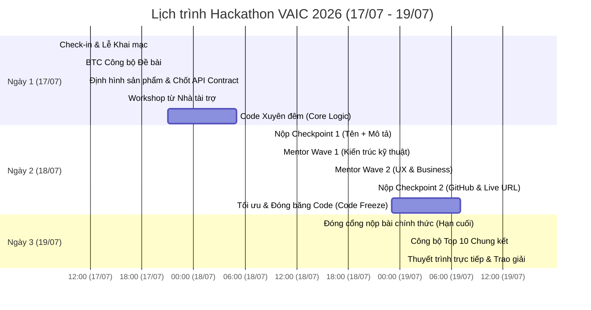

# KẾ HOẠCH CHI TIẾT & PHÂN TÍCH DỰ ÁN VIBONYMUS — VAIC 2026

*Tài liệu dành riêng cho PM (Project Manager) của dự án Vibonymus chuẩn bị tham gia cuộc thi Vietnam AI Innovation Challenge (VAIC) 2026.*

---

## I. TỔNG QUAN VỀ DỰ ÁN VÀ CUỘC THI VAIC 2026

### 1. Thông tin chung về Cuộc thi
*   **Tên cuộc thi:** Vietnam AI Innovation Challenge (VAIC) 2026.
*   **Thông điệp chủ đạo:** "TRAIN’SFORMATION".
*   **Đơn vị tổ chức:** Trung tâm Đổi mới sáng tạo Quốc gia (NIC), Tập đoàn Meta, Tổ chức AI for Vietnam (AIV), và Đại học Duy Tân.
*   **Thời gian diễn ra Hackathon:** Từ ngày **17/07 đến 19/07/2026** (48 giờ thi đấu liên tục).
*   **Địa điểm trực tiếp:** Trung tâm Đổi mới sáng tạo Quốc gia (NIC), Hòa Lạc, Hà Nội.
*   **Nhà tài trợ hạ tầng/GPU:** FPT AI Factory (tài trợ Cloud Credits trị giá 2.000 USD cho mỗi đội trong Top 5).
*   **Giải thưởng chính:**
    *   **Quán quân:** 1.000 USD cash.
    *   **Á quân:** 800 USD cash.
    *   **Quý quân:** 500 USD cash.
    *   **Giải Best PyTorch Award:** 5.000 USD do Meta tài trợ (dành cho đội có kỹ thuật công nghệ xuất sắc nhất sử dụng PyTorch).
    *   **Cơ hội khác:** Chuyến đi Silicon Valley (tài trợ bởi Vietnam AI Stars Foundation), cơ hội nghiên cứu tại Đại học Công nghệ Nanyang - NTU (Singapore, tài trợ bởi AISG), trình bày tại Vietnam Innovation Day (01/10/2026).

### 2. Định vị Dự án "Vibonymus-prepare"
Dự án là hệ thống **Dashboard Quản lý & Lập kế hoạch thi đấu** dành cho đội **Vibonymus** để tối ưu hóa hiệu suất và phối hợp trong suốt 48 giờ thi đấu.
*   **Công nghệ cốt lõi:** React 18+, Vite (build tool), Vanilla CSS, Oxlint (linter).
*   **Các phân hệ chính trong Dashboard:**
    1.  **Dashboard (Tổng quan):** Theo dõi tiến độ thời gian thực, biểu đồ Gantt 72h, To-Do List và trạng thái tài khoản AI.
    2.  **Agenda (Lịch trình thi đấu):** Lịch chi tiết các buổi training, vòng thi và hạn chót.
    3.  **Roles (Phân vai nhiệm vụ):** Quản lý sơ đồ nhân sự, vai trò, công cụ AI của từng người.
    4.  **AI Resource (Tài nguyên AI):** Thư viện mã nguồn mở, pre-trained models cho 8 track thi đấu.
    5.  **Tracks (Chủ đề thi đấu):** Phân tích yêu cầu kỹ thuật và tiêu chí cho 8 track.
    6.  **Competitors (Phân tích đối thủ):** Bảng xếp hạng và thông tin chi tiết về các đối thủ cạnh tranh cào từ hệ thống của BTC.
    7.  **Workflow (Luồng công việc):** Flowchart SVG trực quan thể hiện quy trình phát triển sản phẩm AI và timeline 48h.

---

## II. SƠ ĐỒ NHÂN SỰ & PHÂN CÔNG VAI TRÒ (TEAM ROLES)

Đội thi Vibonymus gồm **06 thành viên** với sự hỗ trợ của các trợ lý AI chuyên biệt để tăng tốc phát triển (Triết lý AI-Native):

| Thành viên | Vai trò | Trách nhiệm chính | Công cụ AI hỗ trợ |
| :--- | :--- | :--- | :--- |
| **K.AI** | **Tech Lead / Backend & DB** | Dẫn dắt phân tích đề bài, thiết kế Database Schema, xây dựng server Backend, tích hợp API, tối ưu hóa câu lệnh SQL. | **Claude Pro** |
| **Quân** | **Frontend & UI/UX** | Phác thảo wireframe, lên bảng màu/font, code khung giao diện React, hoàn thiện CSS responsive và các hiệu ứng animation mượt mà. | **Claude Max 5x** |
| **Mai** | **QC & Hiệu suất** | Theo dõi tiến độ chung, lập checklist chất lượng (QC), kiểm thử end-to-end, tổng hợp báo cáo hiệu suất giữa chặng. | **Gemini Pro** |
| **Quang** | **AI Core & Grounding** | Đánh giá khả thi AI Agent, cấu hình Vector DB cho grounding (RAG), tinh chỉnh prompt (Prompt Tuning), viết AI Collaboration Log. | **Claude Pro** |
| **Lâm** | **Computer Vision & Security**| Khảo sát mô hình AI/CV khả dụng, đánh giá rủi ro bảo mật hệ thống, pentest lỗ hổng (như OWASP Top 10) và xử lý an toàn dữ liệu. | **Claude Pro** |
| **Yến** | **Business & Pitching** | Đánh giá tính khả thi kinh doanh, xây dựng business case, định vị giá trị (value proposition), soạn slide và chuẩn bị kịch bản demo thuyết trình. | **Gemini Pro** |

---

## III. LỊCH TRÌNH CHI TIẾT & KẾ HOẠCH HÀNH ĐỘNG 48 GIỜ (TIMELINE)

Lịch trình hoạt động của đội bám sát các mốc thời gian của BTC tại NIC Hòa Lạc:



### Các Giai Đoạn Hành Động Cụ Thể của Đội:

#### 1. Giai đoạn 1: Giờ 1–4 (Khởi động & Thiết kế Kiến trúc)
*   **Bắt đầu:** Ngay sau khi công bố đề bài (11:00 ngày 17/07).
*   **Nhiệm vụ:**
    *   **K.AI:** Phân tích đề bài, thiết kế Database Schema (PostgreSQL) và thống nhất API Contract với Quân.
    *   **Quân:** Phác thảo Wireframe giao diện Dashboard, thống nhất UI theme (bảng màu, font).
    *   **Mai:** Lên kế hoạch tiến độ chung, thiết lập checklist kiểm thử (QC).
    *   **Quang:** Đánh giá tính khả thi AI Agent và yêu cầu dữ liệu cho Vector DB (RAG).
    *   **Lâm:** Tìm kiếm mô hình AI/CV phù hợp, đánh giá rủi ro bảo mật ban đầu.
    *   **Yến:** Phân tích bối cảnh kinh doanh của track để định hình sản phẩm.
*   **Đầu ra bắt buộc:** Chốt API contract nháp (Swagger/Markdown), kết nối cơ sở dữ liệu trống, duyệt xong Wireframe.

#### 2. Giai đoạn 2: Giờ 5–24 (Tăng tốc Phát triển → Checkpoint 1)
*   **Nhiệm vụ:**
    *   **K.AI:** Dựng server Backend, code các API endpoints cơ bản, tạo dữ liệu mock.
    *   **Quân:** Code khung giao diện React, thiết lập state và component dùng chung.
    *   **Quang & Lâm:** Viết service kết nối LLM, cấu hình Vector DB, bắt đầu huấn luyện/thử nghiệm mô hình.
    *   **Mai:** Giám sát tiến độ, chuẩn bị bộ dữ liệu test.
    *   **Yến:** Viết tuyên bố giá trị (value proposition) và dựng khung slide pitch.
*   **Mốc quan trọng (Checkpoint 1):** Nộp **Tên dự án** và **Mô tả ngắn** (track chọn, giải pháp, hướng tiếp cận) lên platform của BTC trong khung giờ **09:00 - 10:30 ngày 18/07**.

#### 3. Giai đoạn 3: Giờ 25–36 (Tích hợp sâu & Đánh bóng → Checkpoint 2)
*   **Nhiệm vụ:**
    *   **K.AI:** Nhúng dịch vụ AI vào Backend, tối ưu hóa truy vấn SQL, vá các lỗ hổng bảo mật đầu vào.
    *   **Quân:** Tích hợp API thật từ Backend, thêm animation, tinh chỉnh responsive CSS.
    *   **Quang:** Thực hiện Prompt Tuning để tăng độ chính xác của Agent, ghi chép tài liệu **AI Collaboration Log** (bắt buộc cho tiêu chí AI-Native).
    *   **Lâm:** Quét bảo mật toàn hệ thống (Pentest), xử lý các vấn đề dữ liệu nhạy cảm.
    *   **Mai:** Chạy kiểm thử end-to-end (QC vòng 1) để rà lỗi giao diện và logic.
    *   **Yến:** Hoàn thiện business case (Enterprise Pilot Dynamics) và chuẩn bị slide thuyết trình.
*   **Mốc quan trọng (Checkpoint 2):** Nộp **Live deployed URL** (đường dẫn chạy thử sản phẩm) và link **GitHub repository (public)** trong khung giờ **21:00 - 23:00 ngày 18/07**.

#### 4. Giai đoạn 4: Giờ 37–48 (Đóng gói & Chuẩn bị Demo Day)
*   **Nhiệm vụ:**
    *   **Cả team:** Khắc phục các lỗi nghiêm trọng (blockers) phát hiện từ QC.
    *   **K.AI & Quân:** Đóng băng mã nguồn (Code Freeze) lúc **07:00 sáng ngày 19/07**.
    *   **Yến & Mai:** Quay video Demo sản phẩm (thời lượng $\le 5$ phút), hoàn thiện Slide Pitching.
*   **Hạn chót nộp bài (Final Submission):** **09:00 sáng ngày 19/07**. Đầy đủ 5 hạng mục: Slide, Video Demo, GitHub link, Live URL, và Project description.

---

## IV. QUẢN LÝ QUOTA VÀ PHƯƠNG ÁN DỰ PHÒNG KHI AI CHẠM GIỚI HẠN (AI LIMIT FALLBACK)

Vì dự án được phát triển theo triết lý **AI-Native**, các thành viên sử dụng tài khoản AI trả phí (Claude Pro, Claude Max). Để tránh bị gián đoạn khi tài khoản chạm giới hạn (limit) giữa chừng, đội đã thiết kế sẵn **Kế hoạch Dự phòng (Gantt Fallback)**:

*   **Khung giờ AI hoạt động bình thường (AI Active):** Cần tập trung code các phần core logic khó, thiết kế DB và lập trình module AI.
*   **Khung giờ AI bị giới hạn (⏳ Limit):**
    *   Sử dụng tài khoản phụ (Free tier) hoặc chia sẻ token API.
    *   Chuyển sang thực hiện các nhiệm vụ thủ công (manual) theo phân công:

| Thành viên | Công việc thủ công khi AI bị giới hạn |
| :--- | :--- |
| **K.AI** | Thực hiện review chéo mã nguồn; viết tài liệu API/README; setup thủ công hạ tầng (Docker, ENV, DB backup). |
| **Quân** | Tự tay tinh chỉnh CSS responsive, khoảng cách (spacing); viết tài liệu hướng dẫn sử dụng các React Component; test giao diện thủ công trên Chrome/Safari/Mobile. |
| **Quang** | Đọc log phản hồi của RAG để tìm lỗi logic; tổng hợp tài liệu **AI Collaboration Log** (ghi lại quá trình phối hợp với AI); phác thảo sẵn prompt nháp trên file Note. |
| **Lâm** | Thực hiện rà soát bảo mật thủ công theo danh sách OWASP Top 10; viết báo cáo Pentest dựa trên kết quả đã quét trước đó; kiểm tra cấu hình mạng. |

---

## VI. CHIẾN LƯỢC ĐẠT ĐIỂM TỐI ĐA (SCORING STRATEGY)

Để thuyết phục Ban giám khảo (gồm Domain Expert, Technical Judge, Non-tech Industry Judge và Senior Judge), giải pháp của Vibonymus cần đáp ứng xuất sắc các tiêu chí sau:

### 1. Chiều sâu Kỹ thuật & Sự tham gia của AI (20 điểm)
*   AI phải xử lý logic nghiệp vụ lõi (ví dụ: định tuyến tác vụ thông minh bằng LangGraph, tự động truy vấn SQL) chứ không chỉ đơn thuần là một chatbot bọc giao diện (wrapper).
*   **Bắt buộc:** Phải nộp tài liệu **AI Collaboration Log** để chứng minh AI tham gia trực tiếp vào quá trình phát triển (đáp ứng lời thề 100% AI-Native Oath).
*   *Tính phòng thủ (Defensibility):* Cần trả lời rõ ràng câu hỏi: *"Khi chi phí viết code bằng AI ngày càng rẻ, điều gì ngăn cản đối thủ sao chép sản phẩm của bạn trong 24 giờ?"* (Lợi thế về dữ liệu phản hồi, thuật toán tối ưu riêng, v.v.).

### 2. Kiến trúc AI-Native & Tính Đổi mới (20 điểm)
*   Sản phẩm phải thuộc nhóm **Transformational (AI-Native)** — tức là giá trị cốt lõi của sản phẩm được vận hành dựa trên khả năng suy luận (reasoning) của AI và có vòng lặp dữ liệu phản hồi độc quyền để cải tiến.
*   Tránh thiết kế dạng **Incremental (AI Feature)** — chỉ nhúng thêm tính năng AI phụ trợ như tự động điền (autocomplete). AI phải giải quyết bài toán cốt lõi tốt hơn vượt trội so với phương pháp truyền thống.

### 3. Tính khả thi Kinh doanh & Lộ trình Triển khai (20 điểm)
*   Áp dụng mô hình **Enterprise Pilot Dynamics**:
    *   Làm rõ 3 câu hỏi: *Giải quyết vấn đề gì? Đội thi có đủ năng lực giải quyết không? Khách hàng có sẵn sàng trả tiền không?*
    *   Phân biệt rõ **Người dùng (Users)** (quan tâm đến giảm tải vận hành) và **Khách hàng trả tiền (Customers)** (quan tâm đến giảm thiểu rủi ro, thời gian hoàn vốn ROI, hiệu quả dòng tiền).
    *   Xác định rõ 3 chỉ số ROI: **Hiệu suất (Efficiency)**, **Độ chính xác/Chất lượng (Accuracy/Quality)**, và **Khả năng mở rộng (Scale)**.
    *   *Nguyên tắc thử nghiệm (Pilot):* Chọn giải quyết triệt để 1 điểm nghẽn (bottleneck) cụ thể có rủi ro thấp nhưng giá trị cao, thay vì cố gắng thay thế toàn bộ quy trình công việc phức tạp của doanh nghiệp ngay lập tức.

---

## VII. PHÂN TÍCH ĐỐI THỦ CẠNH TRANH VÀ PIPELINE CÀO DỮ LIỆU (COMPETITORS SCRAPER)

Để phục vụ phân tích chiến thuật, dự án đã xây dựng công cụ cào dữ liệu thực tế của **234 đội thi** (dữ liệu cập nhật mới nhất ngày 14/07/2026 trên `hub.aiforvietnam.org`).

### 1. Kiến trúc Scraper tĩnh (Không cần Backend)
*   Vì website Dashboard của Vibonymus là trang tĩnh (Vite + React), việc cào dữ liệu được thực hiện local và xuất ra file JSON tĩnh (`src/data/competitors-data.json`) để import trực tiếp vào giao diện.
*   Cách tiếp cận này giúp tránh được các lỗi CORS, không yêu cầu duy trì server Backend riêng, và bảo mật thông tin tài khoản của từng thành viên.

### 2. Các phương án thực hiện cào dữ liệu
*   **Phương án 1 (Chrome Extension - Khuyến nghị):**
    1.  Tải thư mục `extension/` của dự án lên Chrome qua chế độ nhà phát triển (Unpacked).
    2.  Đăng nhập vào trang `hub.aiforvietnam.org`.
    3.  Bấm nút cào trên Extension để tự động thu thập thông tin và tải về file JSON.
    4.  Copy file vào `data/scrapes/` trong mã nguồn dự án.
*   **Phương án 2 (Playwright Script - Dự phòng):**
    Script CLI tự động lái trình duyệt Chrome để người dùng đăng nhập, lưu lại session và cào dữ liệu tự động thông qua câu lệnh:
    ```bash
    npm run scrape
    ```

### 3. Quy trình hợp nhất dữ liệu (Hạn chế xung đột Git)
Khi nhiều thành viên cùng chạy cào dữ liệu:
*   Mỗi thành viên chỉ đẩy file JSON cào được với tên file duy nhất (ví dụ: `<tên_thành_viên>_<timestamp>.json`) lên GitHub để tạo Pull Request.
*   Một **GitHub Action** tự động (`rebuild-competitors-index.yml`) sẽ nhận diện file mới, tự động gộp dữ liệu, sinh log thay đổi (`CHANGELOG.md`) và ghi đè vào file hiển thị chính `competitors-data.json`. Điều này giúp triệt tiêu hoàn toàn tình trạng xung đột code (git conflict).

---

## VIII. ĐIỂM CẦN LÀM RÕ / PM CẦN QUYẾT ĐỊNH (OPEN QUESTIONS)

Để kế hoạch chuẩn bị đạt độ chính xác 100%, kính đề nghị PM phản hồi và làm rõ một số điểm sau:

> [!IMPORTANT]
> 1.  **Lựa chọn Track thi đấu:** Đội Vibonymus đã chốt lựa chọn track thi đấu chính thức nào trong số 8 track chưa? (Có thể thay đổi trước mốc Checkpoint 1 lúc 09:00 ngày 18/07).
> 2.  **Thông tin tài khoản cào dữ liệu:** Tài khoản đăng nhập `hub.aiforvietnam.org` dùng cho Chrome Extension để cào dữ liệu đối thủ đã được phân bổ cho ai phụ trách chạy chưa?
> 3.  **Tình trạng tài khoản AI trả phí:** Các thành viên (K.AI, Quân, Quang, Lâm) đã kích hoạt và kiểm tra giới hạn quota trên tài khoản Claude Pro/Max của mình chưa? Có cần chuẩn bị thêm tài khoản phụ dự phòng không?
